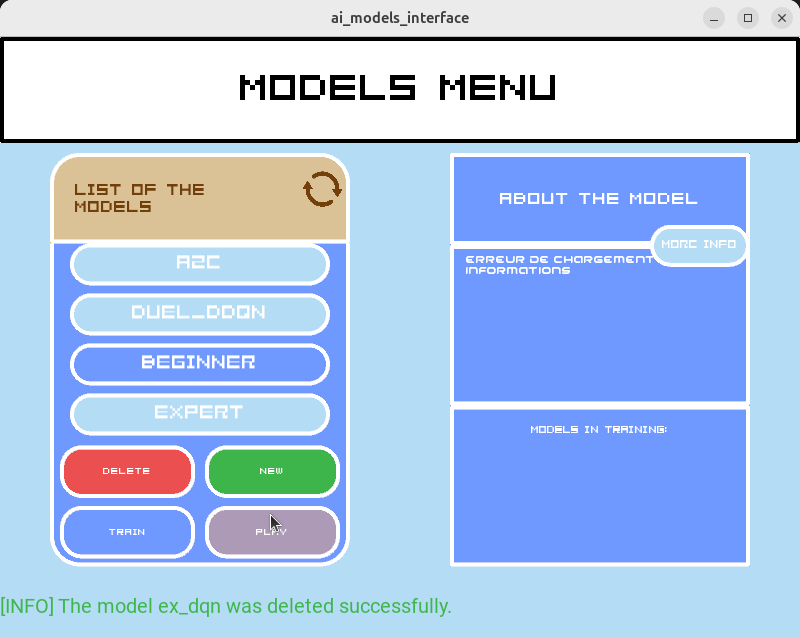
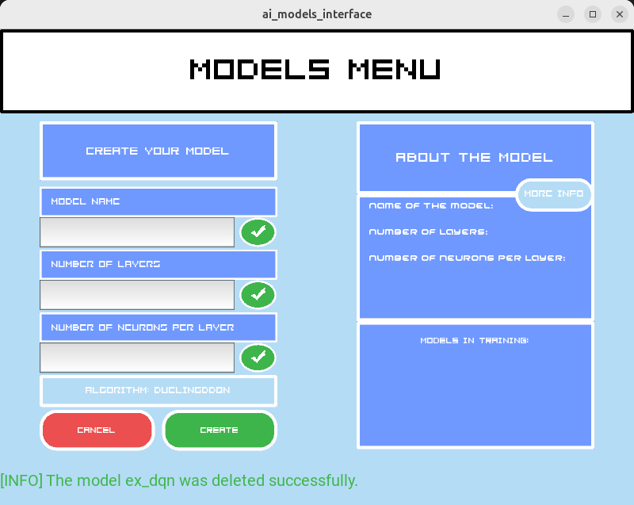
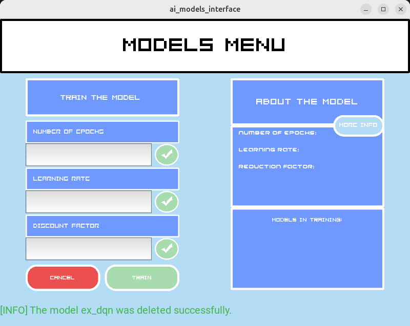
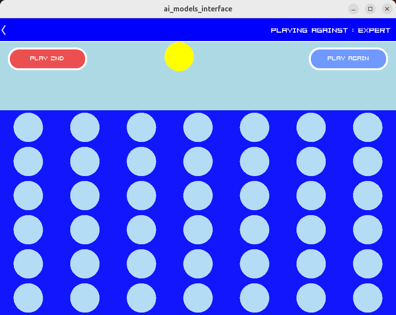
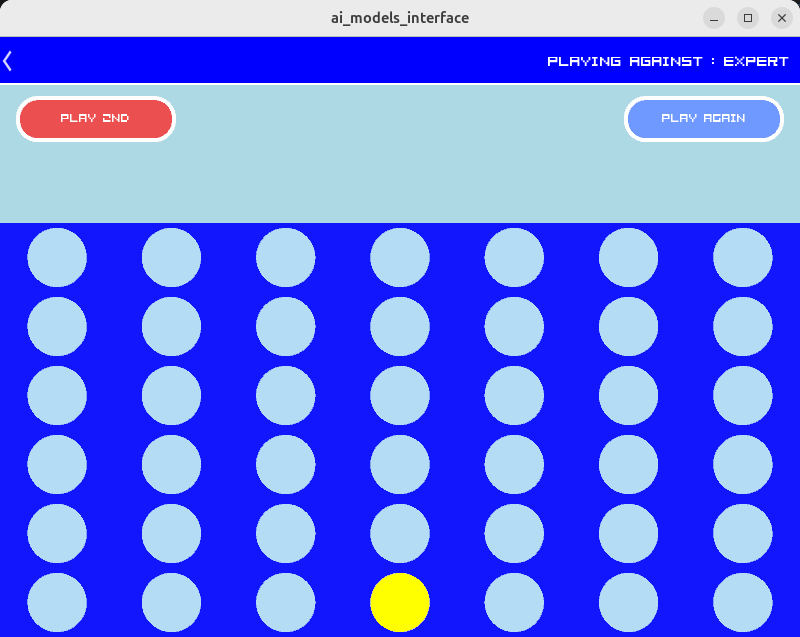
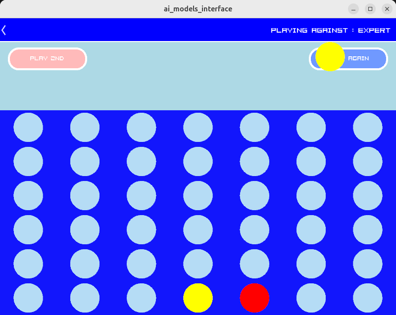
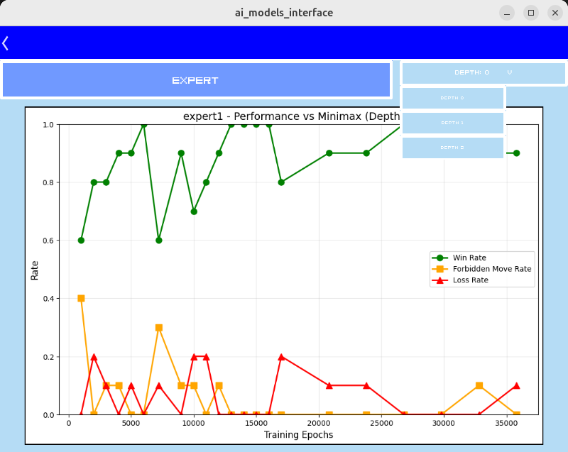

# Connect 4 RL Solving

The goal of the repo is to try different RL algorithms to play connect4 (model free). This is an extension to my Roboticc arm pplaying connect4 project, that explores more deeply the different algorithms that can solve the task. 

You can train your own models with customed parameters for each RL algorithm directly in the UI. The purpose of this is to offer an easy way for people to explore RL algorithms, and add their own, following the same structure as DQN example. 

This project is in developpement. For the moment, the algorithms avaible are:
- Double DQN


## Core components

- **/scripts/Env.py**: The Connect4 environnement
- **/scripts/Train.py**: Training scripts for algorithms
- **/scripts/Connect4.py**: The basic rules for the connect4 (useful for the env)
- **/scripts/rl_algorithms**: The folder containing the avaible algorithms (in which you can create yours).
- **/graphics**: The folder containing the graphics part
- **Experience Replay**: Efficient learning through stored game experiences
- **Epsilon-Greedy Strategy**: Balanced exploration vs exploitation
- **Model Persistence**: Save and load trained models
- **GUI Interface**: Interactive game interface using Kivy

## Architecture

### Core Components

| File | Description |
|------|-------------|
| `DQN2.py` | Enhanced Deep Q-Network implementation with TensorFlow/Keras |
| `Train2.py` | Training pipeline for multi-agent self-play |
| `Connect4.py` | Core Connect 4 game logic and board management |
| `env.py` | Game environment following OpenAI Gym-style interface |
| `connect4InterfaceNoRobot.py` | GUI interface for human vs AI gameplay |

### Installation

1. **Clone the repository**
   ```bash
   git clone <your-repo-url>
   cd connect_4_dqn
   ```

2. **Set up Python environment**
   ```bash
   # Create conda environment (recommended)
   conda create -n connect4_dqn python=3.10
   conda activate connect4_dqn
   
   # Install dependencies
   pip install tensorflow >= 2.16.1 numpy kivy
   ```

### Quick Start

```bash
python main.py
```

#### 1. Test the defaults models

There is one model avaible for each algorithm.

Select the desired algorith and press play.




#### 2. Make your own model

In the main menu, select "New" button and enter the desired parameters for your model.



You can also delete a model.

#### 3. Train AI Agents

In the main menu, select the model you want to play, then press train.

Finally, select the parameters for the training, and start it !




## How does the agent train ?

The goal of the repo is to make the best agents from nothing. I didn't want to train an agent against a predefind algorithm such as minimax, because it implicitly requires a knowlage of the game as a prerequisite. Therefore, I chose to train 2 RL agents against each other.


In the point of view of an agent, the shot of the opponent is cosidered as a part of the environnement. For example:

Let's say we start a game:



First agent (agent1) plays:



Second Agent (agent2) plays:



Agent1 plays: 


For an agent, the observation is constituted by the vector [state, action, next_state, reward, done].

Here, for example, the state and the next state would be:

|  | State | Next State |
|-------|-------|------------|
| Agent 1 |  |  |
| Agent 2 |  |  |


### State Representation
- **Representation**: 6×7 grid flattened to 42-element vector : 0 (empty), 1 (player 1), 2 (player 2)
- **Encoding**: One hot => state of size 3*42 because : 0 = [0, 0, 0] // 1 = [1, 1, 0] // 2 = [0, 0, 1] //   

### Action Space
- **Actions**: 7 possible column choices (0-6)
- **Invalid Moves**: Handled by environment with negative rewards

### Reward System
- **Win**: +10 reward
- **Loss**: -10 reward  
- **Draw**: 0 reward
- **Invalid Move**: -15


## 📊 Model Performance


### RL vs MINIMAX

Reward and Game length are not good metrics for this environnement. The only way to measure how good an agent performs is to play against it, or **measure its winrate against a performing agent**. 

Then, I evaluate its performance by measuring its winrate frequently against the **minimax algorith** (that explore all the possibilities in the future and takes the best one). I evaluate it for different levels of exploration's depth of minimax algorith (1, 2 and 3). 3 means that the algorithm will explore 3 shots in the future to take the best action.

These are avaible in "More info" which takes you to this menu:



## 🎮 Game Interface

The GUI interface (`connect4InterfaceNoRobot.py`) provides:
- **Interactive Board**: Click to drop pieces
- **AI Opponent**: Play against trained DQN
- **Visual Feedback**: Real-time game state updates
- **Score Tracking**: Win/loss statistics

## 🤝 Contributing

1. Fork the repository
2. Create a feature branch (`git checkout -b feature/amazing-feature`)
3. Commit changes (`git commit -m 'Add amazing feature'`)
4. Push to branch (`git push origin feature/amazing-feature`)
5. Open a Pull Request

## 📝 License

This project is licensed under the MIT License - see the [LICENSE](LICENSE) file for details.


## 📞 Contact

- **Author**: [Sami Leroux]
- **Email**: [sami.lerouxpro@gmail.com]
- **Project Link**: [https://github.com/SamS709/ned_project](https://github.com/SamS709/ned_project)


